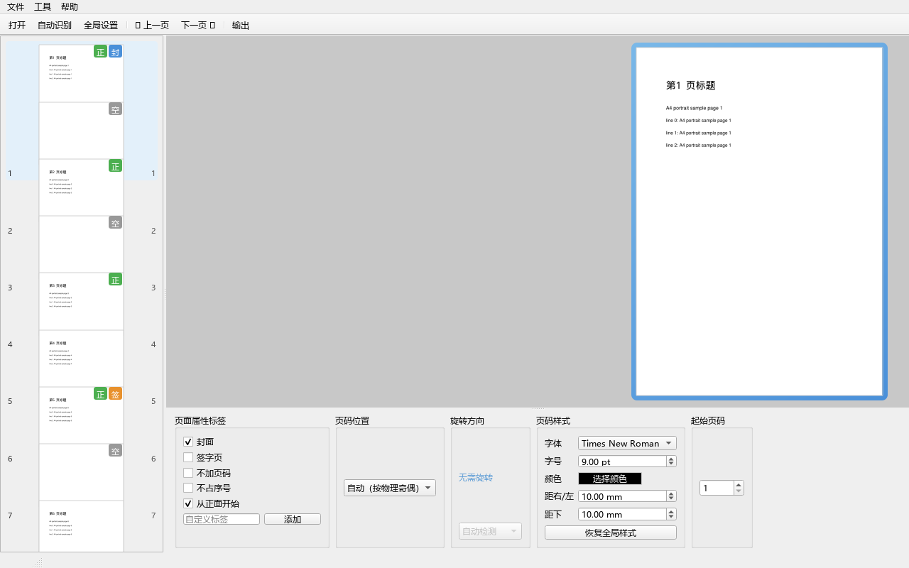

# PDFSim 使用说明书

> 面向普通办公人员的软件使用手册（无需任何技术背景）

---

## 一、软件简介

**PDFSim 是什么？**

PDFSim 是一款 Windows 桌面小工具，帮助你在 **PDF 文件上添加"打印装订页码"**。

打印装订的 PDF 有特殊要求：页码必须按"正反面"排布——正面（奇数页）页码在**右下角**、背面（偶数页）页码在**左下角**；封面、签字页需要从正面开始；A3 纸需要旋转到正确方向。手动做这些又慢又容易错，PDFSim 一键帮你完成。

**解决什么问题？**
- 自动给 PDF 加上符合双面打印习惯的页码；
- 自动处理封面、签字页、目录、A3 大纸等特殊页面；
- 生成的打印文件与原文件完全独立，**绝不改动你的原文件**。

**适用场景**
- 打印装订投标文件、合同、标书、报告、论文等需要双面打印的文档；
- 含 A3 图纸、封面签字页等特殊页面的文档。

---

## 二、系统要求

| 项目 | 要求 |
|------|------|
| 操作系统 | Windows 10 / 11（64 位） |
| 安装 Python | **不需要**（软件已打包为独立程序） |
| 磁盘空间 | 约 500 MB |
| 首次启动 | 可能稍慢（3–10 秒，正在解压程序），请耐心等待 |

---

## 三、快速开始（3 步完成）

1. **双击 `PDFSim.exe`** 启动软件。
   - 首次启动稍等几秒，出现主窗口即成功。
   - 主窗口样子：

   

2. **点击工具栏的"打开"**，选择你的 PDF 文件。
   - 打开后，左侧会列出每一页的缩略图，中间显示当前页，底部是设置面板。

3. **点击"输出"**，软件在同文件夹生成一个名为 **`原文件名（打印装订）.pdf`** 的新文件。
   - 这个新文件就是打印用的，直接拿去打印即可。
   - 你的原文件从头到尾不会被改动。

---

## 四、界面说明

主窗口分三个区域：**左侧缩略图列表**、**中间书视图**、**底部配置面板**。

### 4.1 左侧：页面列表（缩略图）

按打印后的物理顺序列出每一页（软件会自动插入需要的空白页，也会显示在列表中）。

每页右上角的小徽标表示该页的特殊身份：

| 徽标 | 含义 |
|------|------|
| `封` | 封面页（蓝色） |
| `签` | 签字页（橙色） |
| `无` | 不加页码（灰色，内容保留、无页码、序号跳过） |
| `正` | 从正面开始（绿色） |
| `空` | 空白页（软件自动插入） |
| `旋` | 该页会被旋转（蓝色） |

点击任意一页，中间的书视图会跳到那一页并高亮显示。

**双列显示（自适应）**：拖动窗口中间的分隔条把左侧面板**拖宽**时，缩略图自动变成**双列/多列**（同屏看更多页）；**拖窄**时自动回到**单列**。无需任何设置。

**滚动平滑**：鼠标滚轮在缩略图上滚动时按小步长平滑滚动（每格约 24 像素），不再"一滚好几行"；键盘 PageUp/PageDown 仍按页跳转。

#### 多选批量

按住 `Ctrl` / `Shift` 或在缩略图列表拖拽，可**多选**若干页（支持批量应用属性与设置）：

- 书视图右上角显示 **"已选 N 页"**；
- 底部面板切换为**批量模式**：
  - **属性标签**（封面/签字页/不加页码/从正面开始）用**三态**显示（实心=全部勾选、半勾=部分勾选、空白=全部未勾选），点击切换全部添加/全部移除；
  - **旋转方向**可选：多选后可直接统一旋转所有选中页（全部一致时回显该值；不一致显示"自动检测"占位，选择后统一覆盖）；空白页不参与（旋转跟随同纸正面）；
  - **页码样式**可选：字体/字号/颜色/边距/垂直位置可批量统一设置，"恢复全局样式"可批量清除覆盖；
  - **页码位置 / 自定义标签**仍禁用（保持单页专属）；
- 多选后鼠标点选单页即回到单页模式。

#### 空白页配置

自动插入的空白页（封面背面等）也可点选后单独设置：

- 空白页上**封面 / 签字页 / 从正面开始**自动置灰、自定义标签不可用；
- **"不加页码"可用**：勾选后该空白页不显示页码、序号跳过（覆盖其来源默认，如封面背面默认有页码）。

### 4.2 中间：书视图（模拟装订后的书）

- 像翻书一样展示"正反面"，模拟打印装订后的样子；
- **翻页方式**：鼠标滚轮、键盘方向键，或工具栏的"上一页/下一页"按钮；
- 当前选中的页外围有蓝色光晕；
- A3 大页会以横向纸面显示，左上角带"旋"角标（表示会被旋转到正确方向）。

### 4.3 底部：页面配置面板

选中某一页后，这里显示该页的设置，分几个区域：

- **页面属性标签**：封面 / 签字页 / 不加页码 / 从正面开始（每个标签悬停可看说明）；
- **页码位置**：自动（奇数页右下、偶数页左下）/ 右下角 / 左下角 / 右上角 / 左上角 / 自定义偏移；
- **垂直位置**：底部 / 顶部（页码贴在页面底边或顶边，配合距上/距下边距使用）；
- **旋转方向**：自动检测 / 顺时针 90° / 逆时针 90° / 不旋转；
- **页码样式**：字体、字号、颜色、边距；
- **起始页码**：第一页的页码数字（默认 1）。

---

## 五、操作指南

### 5.1 基本流程

**打开 → 标记特殊页面 → 输出**，三步完成。

### 5.2 标记特殊页面

在缩略图列表点选一页，再到底部面板勾选对应的标签：

| 场景 | 怎么操作 | 效果 |
|------|----------|------|
| **封面页** | 勾选"封面" | 自动同时勾选"从正面开始"，封面背面自动插入空白页 |
| **签字页** | 勾选"签字页" | 自动从正面开始，背面留出空白 |
| **不需要页码的页** | 勾选"不加页码" | 保留原内容、不显示页码数字、序号跳过——后续页页码顺延前移（如页1"1"、页2无、页3"2"） |
| **自动插入的空白页** | 选中空白页，勾选"不加页码" | 空白页不显示页码、序号跳过（覆盖来源默认，如封面背面默认有页码） |
| **多页批量设置** | 缩略图多选后勾选标签 | 一次应用到所有选中页（三态显示当前勾选情况） |
| **某页要从正面开始** | 勾选"从正面开始" | 该页落在纸的正面（右侧），前面自动补空白 |
| **A3 大页** | 无需操作 | "从正面开始"自动锁定，不可取消 |

> 提示：勾选"封面"后，"从正面开始"也会自动勾上（这是正常的联动），可手动取消（A3 页除外）。

### 5.3 调整页码位置

- **自动模式（推荐）**：奇数页右下角、偶数页左下角，符合双面打印习惯；
- **指定四角**：可选 右下角 / 左下角 / 右上角 / 左上角，页码固定在所选角落；
- **垂直位置**：默认"底部"（页码在页面下方，距下边距生效）；可切到"顶部"（页码在页面上方，距上边距生效）；
- **自定义偏移**：选择"自定义"后，输入 X / Y 偏移量（单位毫米），把页码往内挪。

### 5.4 调整旋转方向

对需要旋转的页（A4 横向、A3 纵向），在"旋转方向"下拉框选择：

- **自动检测（推荐）**：软件根据页面文字方向自动判断；
- **顺时针 90° / 逆时针 90°**：手动指定；
- **不旋转**：保持原样。

切换后书视图会立即预览旋转效果。

### 5.5 全局设置

工具栏的"全局设置"打开全局设置对话框，可设置：

- **起始页码**：第一页的页码数字（默认 1）；
- **其他空白页自动编页码**（默认**关**）：控制"推正面空白页"与"补齐末页空白页"是否显示页码、占序号——
  - **关（默认）**：这两类空白页不显示页码、不占序号，后续页码顺延（打印更干净）；
  - **开**：它们显示页码、占序号；
  - 封面背面 / 签字页背面 / A3 背面不受此开关影响；
- **页码样式**：全局字体、字号、颜色、边距、垂直位置；
- **自动识别**：封面 / 签字 / 目录 / 正文关键词（多个用英文逗号分隔）；
- **输出**：自动补齐末页、输出文件名后缀。

### 5.6 配置自动保存

- 你做的所有设置**自动保存**，无需手动操作；
- 下次打开**同一个 PDF 文件**时，会自动恢复上次的设置。

---

## 六、输出说明

- **输出文件名**：`原文件名（打印装订）.pdf`（例如 `合同.pdf` → `合同（打印装订）.pdf`）；
- **输出位置**：与原文件同一个文件夹；
- **已存在时**：不覆盖旧文件（会提示"输出文件已存在，已跳过"）；
- **原文件**：全程只读，绝不修改。

---

## 七、处理报告

输出完成后，可以查看一份**处理报告**，逐页列出软件对每页做了什么处理，方便核对与存档。

### 7.1 打开处理报告

三种方式任选其一：

1. **输出完成后**：在"输出完成"提示框里点 **"查看处理报告"**；
2. **工具栏**：点 **"报告"** 按钮；
3. **菜单**：工具 → **"查看处理报告…"**。

### 7.2 报告内容

报告以表格列出每一页（含自动插入的空白页），包括：

| 字段 | 含义 |
|------|------|
| 物理页号 | 输出 PDF 中的实际页序（含空白页） |
| 源文件页号 | 原 PDF 中的页号（空白页显示 -） |
| 页面类型 | 原页 / 空白页 |
| 空白页来源 | 封面背面 / 签字页背面 / 推动正面 / A3 背面 / 补齐末页 / 无 |
| 页面尺寸 | A4 纵向 / A4 横向 / A3 纵向 / A3 横向 / 自定义尺寸 |
| 旋转角度 | 0° / 90° / 180° / 270° |
| 旋转方式 | 自动检测 / 用户覆盖 |
| 页码数字 | 该页显示的页码（无则为 -） |
| 页码位置 | 右下角 / 左下角 / 右上角 / 左上角 / 自定义 |
| 距右/左 (mm) | 页码距页面右边缘与左边缘的边距 |
| 距上/下 (mm) | 页码距页面顶边/底边的边距（按垂直位置显示） |
| 重叠警告 | 有 / 无（页码是否可能与原内容重叠） |
| 页面标记 | 封面 / 签字页 / 不加页码 / 从正面开始 |

### 7.3 导出 CSV

- 点击 **"导出 CSV"** 按钮，选择保存位置；
- 默认文件名：`原文件名_处理报告.csv`（例如 `合同_处理报告.csv`）；
- 文件为 **UTF-8 编码（带 BOM）**，用 Excel 直接打开不会乱码；
- 报告只读展示，**不会修改你的规划与输出文件**。

---

## 八、常见问题

**Q1：打开 PDF 时报错？**
答：可能是文件损坏或不是有效 PDF。请确认文件可以正常打开。若文件确实损坏，软件会弹出提示。

**Q2：PDF 需要密码怎么办？**
答：打开时会弹出密码输入框，输入密码即可继续（如果记得密码）。

**Q3：提示"页码位置可能与原有内容重叠"？**
答：说明页码会压到页面原有的文字。可以把该页"页码位置"改成自定义偏移，把页码往内移动一些，或调整边距，警告会消失。此提示不阻止输出。

**Q4：为什么首次启动有点慢？**
答：软件是单文件打包，首次启动需要解压，一般 3–10 秒，之后会快一些。属正常现象。

**Q5：A3 页面怎么处理？**
答：软件自动识别 A3 大纸，自动安排到正确方向并占用单独正反面，无需手动处理。A3 页的"从正面开始"是锁定的（为保证装订正确）。

**Q6：输出文件叫什么名字？在哪里？**
答：叫"原文件名（打印装订）.pdf"，和你的原文件在同一个文件夹里。

**Q7：怎么查看软件对每页做了什么处理？**
答：输出完成后点"查看处理报告"，或点工具栏"报告"按钮，可逐页查看旋转、页码位置、空白页等处理信息，并可导出 CSV 存档。

---

## 九、注意事项

- **原 PDF 不会被修改**——输出的是全新的独立文件；
- **输出文件不要与原文件重名**（软件已自动加后缀避免覆盖）；
- **大文档（超过 100 页）首次加载可能稍慢**，请稍候；
- 若在加密 PDF 上操作，输出文件是**不加密**的新文件（可正常打印）。

---

*—— PDFSim 使用说明书 完 ——*
